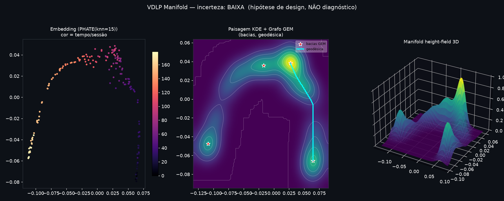
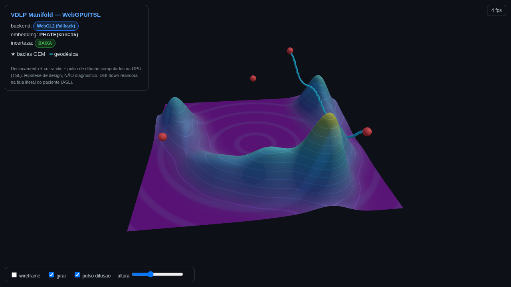

# VDLP Manifold

Pipeline de **visualização de manifolds** para vetores **VDLP** (dados
dimensionais de saúde mental, 15 dimensões). Do vetor bruto ao manifold
renderizável — embedding, paisagem KDE, grafo GEM (bacias, fluxos, geodésicas)
e viewers para **web (WebGPU/TSL)** e **Apple (RealityKit)**.

> ⚠️ **Todos os resultados são HIPÓTESES DE DESIGN, jamais diagnóstico
> clínico.** Todo drill-down deve reancorar na **fala literal do paciente
> (ASL)**. Ver `LICENSE` para o aviso clínico completo.




## Por que PHATE (e não t-SNE)

Sessões clínicas ao longo do tempo formam uma **trajetória contínua** no espaço
15-D. A ordem de preferência do embedding reflete a fidelidade a essa trajetória:

```
PHATE (diffusion map)  >  UMAP (sempre com PCA-init)  >  PCA
```

- **PHATE** preserva a estrutura de trajetória contínua; t-SNE a fragmentaria em ilhas.
- **UMAP** só como fallback e **sempre inicializado por PCA** (estabilidade/reprodutibilidade).
- **Guard-rail:** se `N < 10` sessões, manifold learning não é confiável →
  cai para **PCA simples** e sinaliza **incerteza ALTA**.

## Estrutura

```
vdlp-manifold/
├── python/
│   ├── vdlp_manifold/        # pacote
│   │   ├── dims.py           # as 15 dimensões VDLP (ilustrativas)
│   │   ├── synth.py          # gerador de sessões sintéticas com trajetória
│   │   ├── embed.py          # PHATE > UMAP(PCA-init) > PCA + guard-rail
│   │   ├── heightfield.py    # KDE gaussiano separável (→ MPS/vDSP on-device)
│   │   ├── gem.py            # grafo GEM: watershed + geodésica (Dijkstra)
│   │   ├── preview.py        # preview matplotlib
│   │   └── export.py         # JSON para o viewer web
│   └── run_pipeline.py       # CLI orquestrador
├── web/
│   ├── template_webgpu.html  # viewer WebGPU/TSL (placeholder __DATA__)
│   └── build_viewer.py       # injeta o JSON no template
├── apple/
│   └── VDLPManifoldMesh.swift # RealityKit LowLevelMesh, update in-place
├── tests/                    # pytest de fumaça
├── docs/images/              # previews
├── requirements.txt · pyproject.toml · Makefile
```

## Uso rápido

```bash
# 1. dependências (inclui PHATE/UMAP)
make install-manifold          # ou: pip install -r requirements.txt phate umap-learn

# 2. roda o pipeline -> data/vdlp_manifold.npz, preview.png, manifold_data.json
make run                       # python/run_pipeline.py --sessions 180 --grid 192

# 3. gera o viewer web -> data/viewer_webgpu.html (abra no navegador)
make web

# 4. testes
make test
```

Com seus próprios dados (matriz `X` de forma `(N, 15)` salva em `.npy`):

```bash
cd python && python run_pipeline.py --input meus_vdlp.npy --grid 192 --out ../data
```

## Componentes de rendering

### Web — WebGPU / TSL (`web/template_webgpu.html`)
- `WebGPURenderer` (Three.js r170) com **fallback automático p/ WebGL2**.
- **Na GPU via TSL:** deslocamento de altura (`positionNode`), cor viridis
  polinomial, isolinhas de contorno e **pulso de difusão radial** animado.
- Grade **128²** (checklist 128–256²); bacias como esferas, geodésica como tubo.

### Apple — RealityKit (`apple/VDLPManifoldMesh.swift`)
- `LowLevelMesh` com atualização de buffers **in-place** (a malha nunca é recriada).
- Topologia estática (índices escritos uma vez); grade 128–256² com LOD.
- Checklist: **medir framerate antes** de adicionar efeitos; KDE em MPS/vDSP.

## Grafo GEM

| Conceito GEM     | Representação geométrica            |
|------------------|-------------------------------------|
| eventos          | pontos (o embedding)                |
| clusters/bacias  | watershed dos picos de densidade    |
| fluxos           | descida de gradiente                |
| caminhos         | geodésica (Dijkstra pelos vales)    |

## Estabilidade longitudinal (roadmap)

Para alinhar embeddings entre sessões e evitar rotação/espelhamento do manifold:
**Procrustes** (rígido) ou **Aligned-UMAP** (com âncoras compartilhadas).

## Licença

MIT + aviso clínico — ver `LICENSE`.
