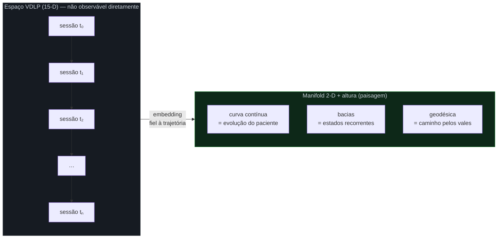
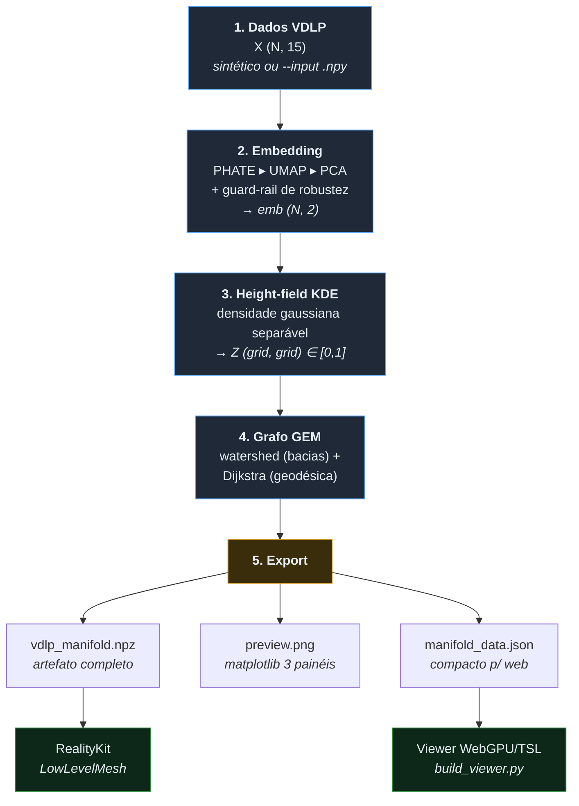
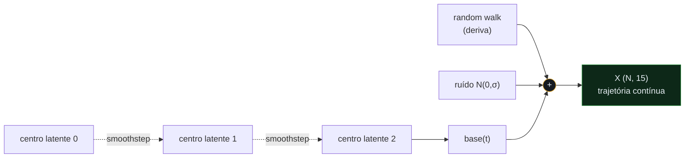
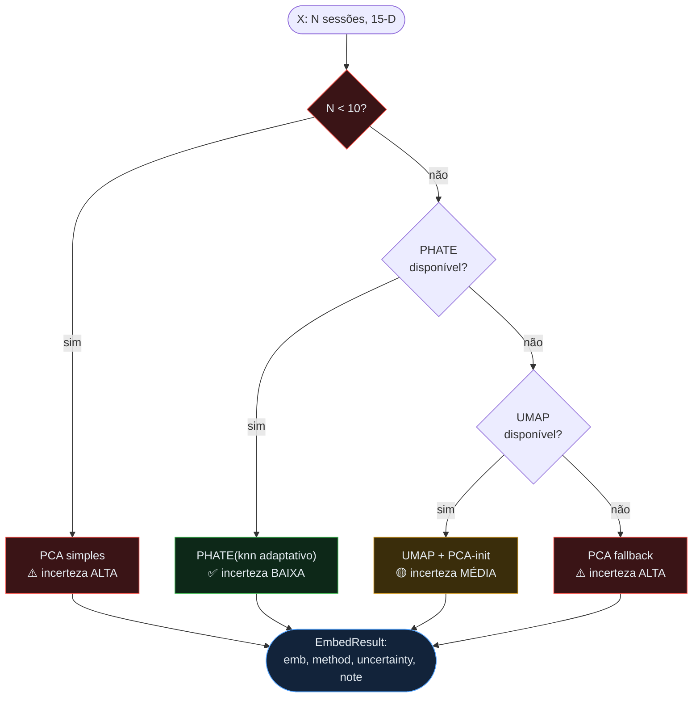
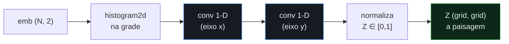
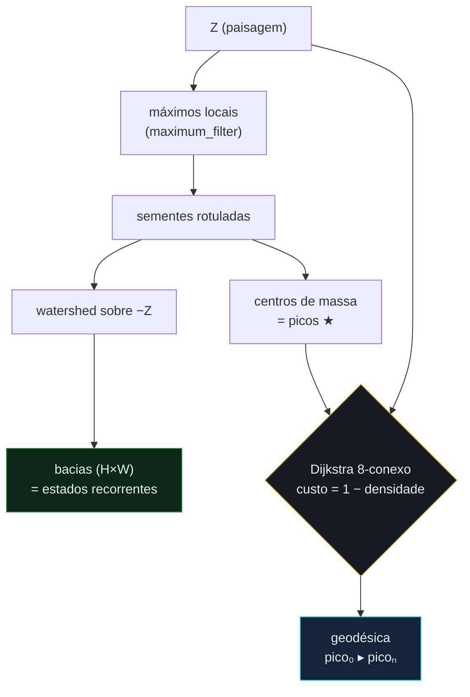
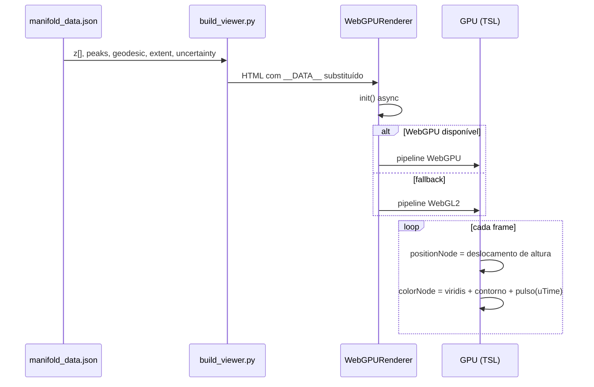
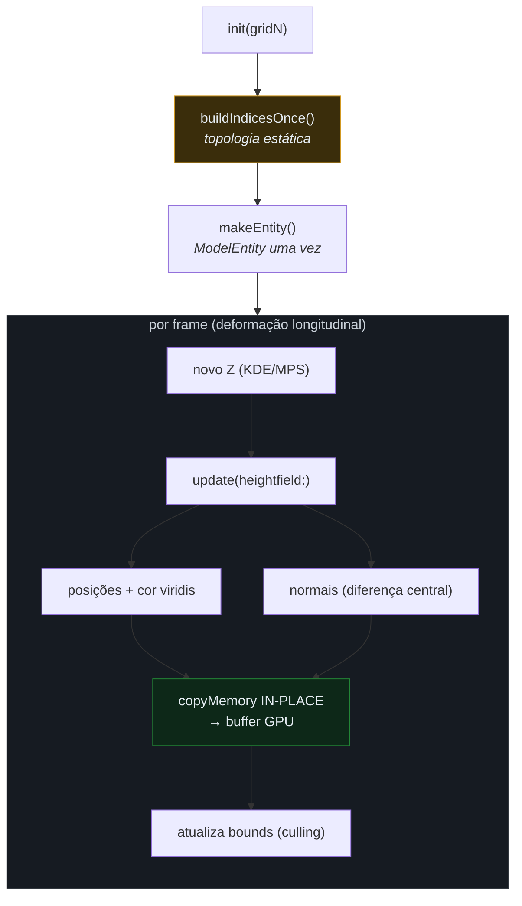
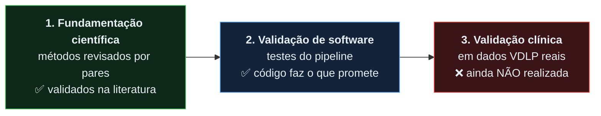
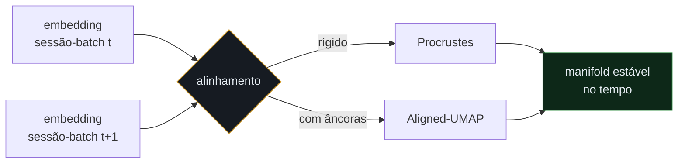

# VDLP Manifold

> Pipeline de **visualização de manifolds** para vetores **VDLP** — 15 dimensões
> de saúde mental. Do vetor bruto de cada sessão ao **manifold renderizável**:
> embedding que preserva trajetória → paisagem de densidade (KDE) → grafo **GEM**
> (bacias, fluxos, geodésicas) → viewers para **Web (WebGPU/TSL)** e **Apple (RealityKit)**.

<p align="center">
  
</p>

<p align="center">
  
</p>

> [!WARNING]
> **Todos os resultados são HIPÓTESES DE DESIGN, jamais diagnóstico clínico.**
> Todo drill-down deve reancorar na **fala literal do paciente (ASL)**.
> Ver [`LICENSE`](LICENSE) para o aviso clínico completo.

---

## Índice

- [O que é um "manifold VDLP"](#o-que-é-um-manifold-vdlp)
- [Visão geral do pipeline](#visão-geral-do-pipeline)
- [Anatomia de cada etapa](#anatomia-de-cada-etapa)
  - [1. Dados VDLP (15-D)](#1-dados-vdlp-15-d)
  - [2. Embedding com decisão automática de robustez](#2-embedding-com-decisão-automática-de-robustez)
  - [3. Height-field via KDE](#3-height-field-via-kde-a-paisagem)
  - [4. Grafo GEM: bacias, fluxos e geodésicas](#4-grafo-gem-bacias-fluxos-e-geodésicas)
  - [5. Export e rendering](#5-export-e-rendering)
- [Arquitetura de rendering](#arquitetura-de-rendering)
- [Validações](#validações)
  - [Fundamentação científica dos métodos](#fundamentação-científica-dos-métodos)
  - [Validação de software](#validação-de-software)
  - [O que ainda NÃO foi validado](#o-que-ainda-não-foi-validado)
- [Inovações](#inovações)
- [Benefícios](#benefícios)
- [Uso rápido](#uso-rápido)
- [Roadmap](#roadmap)
- [Licença](#licença)

---

## O que é um "manifold VDLP"

Cada sessão clínica é resumida em um **vetor VDLP de 15 dimensões** (afeto,
ansiedade, ruminação, sono, conexão social, autoeficácia, …). Ao longo do tempo,
as sessões de um paciente **não** se espalham aleatoriamente pelo espaço 15-D:
elas descrevem uma **trajetória contínua** — o paciente transita suavemente entre
estados latentes, com deriva e ruído.

Esse conjunto de trajetórias vive sobre uma superfície de baixa dimensão
embutida no espaço 15-D — um **manifold**. O objetivo deste projeto é **revelar
essa superfície** de forma fiel e navegável, sem inventar estrutura que não
existe nos dados.



---

## Visão geral do pipeline

Cinco etapas transformam a matriz `X ∈ ℝ^(N×15)` em artefatos renderizáveis.
Cada etapa tem uma responsabilidade única e é testável isoladamente.



Orquestrado por [`python/run_pipeline.py`](python/run_pipeline.py):

```bash
python run_pipeline.py --sessions 180 --grid 192 --out ../data
```

---

## Anatomia de cada etapa

### 1. Dados VDLP (15-D)

As 15 dimensões estão em [`dims.py`](python/vdlp_manifold/dims.py) (nomes
**ilustrativos** — a semântica vem do seu instrumento). O gerador sintético
[`synth.py`](python/vdlp_manifold/synth.py) é o ponto-chave para *validar* o
pipeline: ele produz uma **trajetória com estrutura conhecida**, para sabermos
se o embedding a recupera.

O paciente sintético atravessa `n_states` centros latentes com:

- **transição suave** entre estados via *smoothstep* `f = 3f² − 2f³`;
- **não-estacionariedade longitudinal** (random walk cumulativo — a "deriva");
- **ruído idiossincrático** por sessão.



> **Por que sintético primeiro?** Com dados reais não sabemos qual é a "resposta
> certa". Com a trajetória sintética, sabemos — e podemos verificar que PHATE a
> reconstrói como um arco contínuo (visível no painel esquerdo do preview).

### 2. Embedding com decisão automática de robustez

O coração da fidelidade. Sessões formam uma **trajetória**; queremos preservá-la.
A ordem de preferência reflete isso:

```
PHATE (diffusion map)  >  UMAP (sempre com PCA-init)  >  PCA
```

- **PHATE** preserva estrutura de trajetória contínua; **t-SNE a fragmentaria em ilhas**.
- **UMAP** só como fallback e **sempre inicializado por PCA** (reprodutibilidade/estabilidade).
- **Guard-rail:** se `N < 10` sessões, manifold learning **não é confiável** →
  cai para **PCA simples** e sinaliza **incerteza ALTA**.

A decisão é uma cascata explícita em [`embed.py`](python/vdlp_manifold/embed.py),
que **degrada com elegância** e sempre reporta *qual método usou* e *quanta
confiança* ele merece:



O `knn` do PHATE é **adaptado a N** (`clip(N/12, 5, 30)`), evitando vizinhanças
grandes demais para poucas sessões ou pequenas demais para muitas.

### 3. Height-field via KDE (a paisagem)

Onde as sessões se concentram no plano do embedding, o "terreno" sobe. A
densidade é estimada por **KDE gaussiano separável** em
[`heightfield.py`](python/vdlp_manifold/heightfield.py):

- histograma 2-D das sessões na grade;
- **convolução gaussiana separável** (dois passes 1-D → `O(N·k)` em vez de `O(N·k²)`);
- *padding refletido* nas bordas (equivalente ao comportamento de `vDSP`);
- bandwidth por regra de **Scott adaptada ao passo da grade**;
- normalização final para `[0, 1]`.



> A separabilidade não é só elegância: é o que torna o KDE viável **on-device**
> em **MPS/vDSP** (Apple) sem estourar o orçamento de frame.

### 4. Grafo GEM: bacias, fluxos e geodésicas

O **GEM** dá semântica geométrica à paisagem, em
[`gem.py`](python/vdlp_manifold/gem.py):

| Conceito GEM      | Representação geométrica                          |
|-------------------|---------------------------------------------------|
| **eventos**       | pontos (o próprio embedding)                      |
| **clusters/bacias** | *watershed* dos picos de densidade              |
| **fluxos**        | descida de gradiente (implícita no watershed)     |
| **caminhos**      | **geodésica** aproximada (Dijkstra pelos vales)   |

As bacias saem de um *watershed* sobre a energia `−Z` (picos de densidade = vales
de energia), com sementes nos máximos locais. A **geodésica** é o caminho de
menor custo numa grade 8-conexa (Dijkstra), com custo `(1 − densidade)`: **barato
nos vales densos, caro nos cumes** — ela prefere seguir a "calha" do manifold,
que é justamente a trajetória de estados recorrentes.



No preview: as **estrelas vermelhas** são bacias GEM e a **linha ciano** é a
geodésica ligando a primeira à última bacia.

### 5. Export e rendering

[`export.py`](python/vdlp_manifold/export.py) reamostra o height-field para uma
grade menor (checklist de performance **128–256²**) e serializa um JSON compacto;
[`preview.py`](python/vdlp_manifold/preview.py) gera a figura de 3 painéis; e o
`.npz` guarda **tudo** (X, embedding, tempo, estado, Z, bacias, picos, geodésica,
extent, dims, método, incerteza) para reprodutibilidade e consumo pelo app Apple.

---

## Arquitetura de rendering

Dois alvos, mesma fonte de dados. Ambos empurram o trabalho pesado para a GPU.

### Web — WebGPU / TSL

[`web/template_webgpu.html`](web/template_webgpu.html) +
[`build_viewer.py`](web/build_viewer.py) injetam o JSON no placeholder `__DATA__`.

- `WebGPURenderer` (Three.js) com **fallback automático para WebGL2**;
- **na GPU via TSL:** deslocamento de altura (`positionNode`), cor **viridis**
  polinomial, **isolinhas de contorno** e **pulso de difusão radial** animado;
- bacias como esferas, geodésica como tubo; HUD mostra backend, método e incerteza.



### Apple — RealityKit

[`apple/VDLPManifoldMesh.swift`](apple/VDLPManifoldMesh.swift) usa
`LowLevelMesh` com **atualização de buffers in-place** — a malha **nunca é
recriada** entre frames, o que é o que permite deformação longitudinal fluida.

- topologia estática: índices do grid triangulado escritos **uma única vez**;
- por frame só mudam **posições + normais + cor** (normais por diferença central);
- grade **128–256²** com **LOD**; disciplina de performance: **medir framerate
  antes** de adicionar efeitos; KDE em **MPS/vDSP**.



---

## Validações

Há **três níveis distintos** de validação, e é fundamental não confundi-los.
Este projeto se apoia em métodos **cientificamente validados na literatura**;
o **código** que os implementa é coberto por testes; mas a **aplicação clínica
a dados VDLP reais ainda não foi validada** — por isso todo resultado é
*hipótese de design, não diagnóstico*.



### Fundamentação científica dos métodos

Cada etapa do pipeline usa um método **estabelecido e revisado por pares** em
sua área de origem (aprendizado de manifolds, estatística, morfologia
matemática, teoria dos grafos). Estas são as referências primárias:

| Método no pipeline | Base científica (peer-reviewed) |
|--------------------|---------------------------------|
| **PHATE** (embedding preferido) | Moon, van Dijk, Wang et al. *Visualizing structure and transitions in high-dimensional biological data.* **Nature Biotechnology** 37, 1482–1492 (2019). [doi:10.1038/s41587-019-0336-3](https://doi.org/10.1038/s41587-019-0336-3) |
| **Diffusion maps** (base teórica do PHATE) | Coifman & Lafon. *Diffusion maps.* **Applied and Computational Harmonic Analysis** 21(1):5–30 (2006). [doi:10.1016/j.acha.2006.04.006](https://doi.org/10.1016/j.acha.2006.04.006) |
| **UMAP** (fallback, PCA-init) | McInnes, Healy, Melville. *UMAP: Uniform Manifold Approximation and Projection for Dimension Reduction.* **arXiv:1802.03426** (2018). [arxiv.org/abs/1802.03426](https://arxiv.org/abs/1802.03426) |
| **PCA** (guard-rail / último fallback) | Jolliffe. *Principal Component Analysis.* 2ª ed., **Springer** (2002). |
| **t-SNE** (contraexemplo: fragmenta trajetória) | van der Maaten & Hinton. *Visualizing Data using t-SNE.* **JMLR** 9:2579–2605 (2008). |
| **KDE / bandwidth de Scott** (height-field) | Scott. *Multivariate Density Estimation.* **Wiley** (1992); Silverman. *Density Estimation for Statistics and Data Analysis.* **Chapman & Hall** (1986). |
| **Watershed** (bacias GEM) | Beucher & Lantuéjoul. *Use of Watersheds in Contour Detection.* Int. Workshop on Image Processing, Rennes (1979). |
| **Dijkstra** (geodésica na grade) | Dijkstra. *A note on two problems in connexion with graphs.* **Numerische Mathematik** 1:269–271 (1959). |
| **Procrustes / Aligned-UMAP** (roadmap) | Gower. *Generalized Procrustes analysis.* **Psychometrika** 40:33–51 (1975). |

> A escolha de preferir PHATE a t-SNE **não é estética**: o próprio artigo do
> PHATE demonstra que ele preserva progressões contínuas (trajetórias) melhor
> que t-SNE, que tende a fragmentá-las em ilhas. É essa propriedade, validada na
> literatura, que sustenta a leitura da trajetória do paciente como uma curva.

### Validação de software

Isto é **validação de engenharia**, não científica: garante apenas que o código
implementa corretamente os métodos acima. Testes de fumaça rápidos em
[`tests/test_pipeline.py`](tests/test_pipeline.py) — que **não dependem** de
PHATE/UMAP — verificam as invariantes do pipeline:

| Teste | O que garante |
|-------|---------------|
| `test_dims_len` | VDLP tem exatamente **15 dimensões**. |
| `test_synth_shapes` | Formas e `dtype` (`float32`) dos dados sintéticos. |
| `test_low_n_falls_back_to_pca_with_high_uncertainty` | Com **N pequeno**, cai para PCA **e sinaliza incerteza ALTA** (o guard-rail funciona). |
| `test_healthy_n_uses_manifold_or_pca_fallback` | Com N saudável, **não** sinaliza incerteza alta por causa de N. |
| `test_heightfield_normalized` | Height-field **normalizado** em `[0,1]` (máx = 1), grade correta, extent com 4 valores. |
| `test_gem_and_geodesic` | Watershed produz **≥ 1 bacia**; a geodésica **começa no pico₀ e termina no picoₙ** exatamente. |

```bash
make test        # python -m pytest -q
make lint        # ruff
```

Há ainda uma **verificação visual de sanidade** embutida no design: o embedding
é colorido por **tempo/sessão** — se a trajetória sintética foi preservada, as
cores variam suavemente ao longo do arco (painel esquerdo do preview). Isto
confirma que o *método recupera uma estrutura conhecida*, mas continua sendo
validação sobre **dados sintéticos**, não sobre pacientes reais.

### O que ainda NÃO foi validado

Para ser honesto sobre o alcance científico deste projeto:

- **Não há validação clínica.** Nenhum estudo com pacientes reais estabeleceu
  que as bacias, fluxos ou geodésicas do manifold correspondem a construtos
  clínicos significativos, nem que têm valor prognóstico ou diagnóstico.
- **Não há validação do instrumento VDLP** aqui: as 15 dimensões em
  [`dims.py`](python/vdlp_manifold/dims.py) são **ilustrativas**; a validade
  psicométrica (confiabilidade, validade de construto) vem do seu instrumento,
  não deste pacote.
- **Os dados de exemplo são sintéticos** — servem para testar o software e
  demonstrar as propriedades dos métodos, não para inferir nada clínico.
- A **incerteza** é reportada em todo artefato (preview, HUD web, `.npz`) para
  que nunca se leia o manifold sem ver o nível de confiança — mas incerteza
  reportada **não substitui** validação clínica prospectiva.

> Em resumo: os **métodos** são cientificamente validados; a **implementação** é
> testada; a **aplicação a VDLP clínico** é uma hipótese de design a ser
> validada em estudo próprio. Todo drill-down reancora na **fala literal do
> paciente (ASL)**.

---

## Inovações

1. **Embedding auto-degradante e auto-explicável.** Não é "rode PHATE e reze":
   é uma cascata `PHATE ▸ UMAP(PCA-init) ▸ PCA` que **sempre entrega um
   resultado**, **sempre diz qual método usou** e **sempre carimba a incerteza**.
   A escolha do algoritmo é orientada pela *fidelidade à trajetória*, não pela moda.

2. **Guard-rail estatístico de honestidade.** `N < 10` → PCA + incerteza ALTA.
   Manifold learning com poucas amostras produz artefatos convincentes e falsos;
   o guard-rail recusa-se a fingir estrutura que os dados não suportam.

3. **A paisagem *é* o modelo.** Em vez de clusters discretos, o KDE produz uma
   **superfície contínua** que respeita a natureza gradual dos estados mentais —
   e o **GEM** lê dessa superfície bacias (estados), fluxos (transições) e
   geodésicas (percursos), unificando "onde o paciente esteve" e "como ele se moveu".

4. **Geodésica pelos vales densos.** Custo `1 − densidade` faz o caminho preferir
   regiões povoadas por sessões reais — a geodésica traça o percurso *plausível*
   entre estados, não uma reta geométrica ingênua.

5. **GPU-first em dois ecossistemas.** O mesmo artefato alimenta um viewer
   **WebGPU/TSL** (com fallback WebGL2) e uma malha **RealityKit** com update
   **in-place**. A separabilidade do KDE foi escolhida pensando em **MPS/vDSP**
   on-device.

6. **Ponte clínica não-negociável.** Cada saída repete que é **hipótese de
   design, não diagnóstico**, e que todo drill-down deve **reancorar na fala
   literal do paciente (ASL)** — a segurança clínica está no código, não só no README.

---

## Benefícios

- **Interpretabilidade sobre trajetória.** Clínicos veem a **evolução** do
  paciente como um percurso numa paisagem — mais próximo de como se pensa em
  narrativa clínica do que uma nuvem de pontos.
- **Robustez a poucos dados.** O guard-rail evita conclusões perigosas em
  pacientes com poucas sessões.
- **Reprodutibilidade.** Seeds fixas, `PCA-init` no UMAP e o `.npz` completo
  tornam cada manifold reproduzível e auditável.
- **Portabilidade.** Um pipeline Python; dois viewers de alta performance
  (browser e Apple) sem reprocessar dados.
- **Performance real.** Design GPU-first, KDE separável e malha in-place mantêm
  o custo de frame sob controle (checklist 128–256², LOD, medir antes de efeitos).
- **Segurança por design.** A incerteza acompanha o dado em todo lugar; o aviso
  clínico é estrutural.

---

## Uso rápido

```bash
# 1. dependências (inclui PHATE/UMAP)
make install-manifold          # ou: pip install -r requirements.txt phate umap-learn

# 2. roda o pipeline -> data/vdlp_manifold.npz, preview.png, manifold_data.json
make run                       # python/run_pipeline.py --sessions 180 --grid 192

# 3. gera o viewer web -> data/viewer_webgpu.html (abra no navegador)
make web

# 4. testes
make test
```

Com seus próprios dados (matriz `X` de forma `(N, 15)` salva em `.npy`):

```bash
cd python && python run_pipeline.py --input meus_vdlp.npy --grid 192 --out ../data
```

### Estrutura do repositório

```
vdlp-manifold/
├── python/
│   ├── vdlp_manifold/        # pacote
│   │   ├── dims.py           # as 15 dimensões VDLP (ilustrativas)
│   │   ├── synth.py          # gerador de sessões sintéticas com trajetória
│   │   ├── embed.py          # PHATE > UMAP(PCA-init) > PCA + guard-rail
│   │   ├── heightfield.py    # KDE gaussiano separável (→ MPS/vDSP on-device)
│   │   ├── gem.py            # grafo GEM: watershed + geodésica (Dijkstra)
│   │   ├── preview.py        # preview matplotlib (3 painéis)
│   │   └── export.py         # JSON para o viewer web
│   └── run_pipeline.py       # CLI orquestrador
├── web/
│   ├── template_webgpu.html  # viewer WebGPU/TSL (placeholder __DATA__)
│   └── build_viewer.py       # injeta o JSON no template
├── apple/
│   └── VDLPManifoldMesh.swift # RealityKit LowLevelMesh, update in-place
├── tests/                    # pytest de fumaça
├── docs/images/              # previews
├── requirements.txt · pyproject.toml · Makefile
```

---

## Roadmap

**Estabilidade longitudinal.** Para alinhar embeddings entre sessões e evitar
rotação/espelhamento do manifold ao longo do tempo:



- **Procrustes** (transformação rígida) ou **Aligned-UMAP** (com âncoras compartilhadas).
- KDE on-device em **MPS/vDSP**; passos de posição/normal em **Metal compute** no alvo Apple.

---

## Licença

MIT + aviso clínico — ver [`LICENSE`](LICENSE).

> **Lembrete final:** este projeto produz **hipóteses de design**, **não
> diagnóstico clínico**. Todo drill-down deve reancorar na **fala literal do
> paciente (ASL)**.
